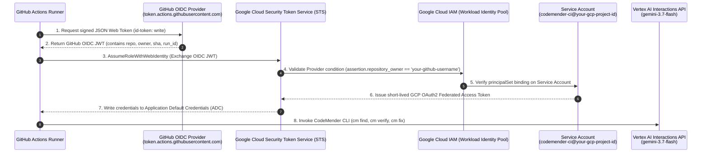

# Workload Identity Federation & CodeMender CI/CD Guardrail: Implementation & Verification Report

---

## 1. Executive Summary

This report documents the end-to-end implementation, verification, and operational governance of **Keyless Workload Identity Federation (WIF)** and **CodeMender Agentic Security Guardrails** for GitHub Actions.

The project demonstrates a modern **Dual Shift-Left** application security paradigm:
1. **Inner Loop (Developer Workstation)**: Instant AST-based pre-commit static linting with Semgrep, followed by local CodeMender agentic remediation before pushing code.
2. **Outer Loop (GitHub Actions CI/CD)**: Autonomous, keyless continuous integration powered by OIDC authentication to Google Cloud, semantic vulnerability discovery across service boundaries, dynamic exploit proof-of-concept verification, autonomous Pull Request generation, and strict security gate deployment blocking.

---

## 2. Architecture & Topology

### 2.1 Keyless Authentication Architecture (WIF + OIDC)



### 2.2 Dual Shift-Left Pipeline Flow

```mermaid
flowchart TD
    subgraph InnerLoop["Inner Loop (Developer Workstation)"]
        A[Developer Modifies Code] --> B[git commit Trigger]
        B --> C[Local Pre-commit Hook: Semgrep AST Scan]
        C -->|Vulnerabilities Detected| D[Export Finding to CodeMender Format]
        D --> E[cm fix & AST Remediation]
        E --> F[Semgrep Re-scan: 0 High/Critical]
        F --> G[git push origin main]
    end

    subgraph OuterLoop["Outer Loop (GitHub Actions Runner)"]
        G --> H[Workflow Trigger: Push to main]
        H --> I[Authenticate via WIF: google-github-actions/auth@v2]
        I --> J[Initialize CodeMender Workspace: cm init & config.yaml]
        J --> K[CodeMender Scan: cm find src/services -y --model gemini-3.7-flash]
        K --> L[Export JSON Report & cm_triage.py Priority Sort]
        L --> M[Verify & Remediate Loop]
        M --> N[cm verify: Dynamic Exploit PoC in .exploit/]
        N -->|VERIFIED (100% Confident)| O[cm fix: Auto-patch Vulnerability]
        O --> P[Autonomous PR: peter-evans/create-pull-request@v6]
        P --> Q[Generate & Upload Visual HTML Security Report]
        Q --> R{Security Gate Check}
        R -->|Unaddressed High/Critical > 0| S[Fail Pipeline: Block Production Deployment]
    end
```

---

## 3. Provisioning & Configuration Verification

### 3.1 Google Cloud Infrastructure

| Resource Type | Resource Name / Identifier | Verification Status | Purpose |
| :--- | :--- | :--- | :--- |
| **GCP Project** | `your-gcp-project-id` (Project Number: `123456789012`) | Verified Active | Allowlisted project for Vertex AI Interactions API |
| **APIs Enabled** | `iam.googleapis.com`, `iamcredentials.googleapis.com`, `cloudresourcemanager.googleapis.com`, `aiplatform.googleapis.com`, `serviceusage.googleapis.com` | Verified Enabled | Core identity, STS exchange, and Vertex AI model invocation |
| **Workload Identity Pool** | `projects/123456789012/locations/global/workloadIdentityPools/github-actions` | Verified Active | Isolated identity boundary for GitHub Actions |
| **OIDC Provider** | `github-oidc` (Issuer: `https://token.actions.githubusercontent.com`) | Verified Active | Validates issuer and repository owner claim (`assertion.repository_owner == 'your-github-username'`) |
| **Service Account** | `codemender-ci@your-gcp-project-id.iam.gserviceaccount.com` | Verified Active | Least-privilege identity used by CI runner |
| **Project IAM Roles** | `roles/aiplatform.user`, `roles/serviceusage.serviceUsageConsumer` | Verified Bound | Access to call Vertex AI models for CodeMender |
| **SA Resource IAM** | `roles/iam.workloadIdentityUser` bound to `principalSet://iam.googleapis.com/projects/123456789012/locations/global/workloadIdentityPools/github-actions/attribute.repository/your-github-username/codemender-wif-lab` | Verified Bound | Scoped authorization restricted strictly to the designated repository |

### 3.2 GitHub Actions Configuration

- **Repository**: `https://github.com/your-github-username/codemender-wif-lab`
- **Workflow Permissions**: `default_workflow_permissions=write`, `can_approve_pull_request_reviews=true` (allows opening autonomous remediation PRs).
- **Repository Variables**:
  - `GCP_WIF_PROVIDER`: `projects/123456789012/locations/global/workloadIdentityPools/github-actions/providers/github-oidc`
  - `GCP_SA_EMAIL`: `codemender-ci@your-gcp-project-id.iam.gserviceaccount.com`
  - `GCP_QUOTA_PROJECT`: `your-gcp-project-id`

---

## 4. Pipeline Execution & Remediation Results

### 4.1 Inner Loop Verification (Developer Workstation)

1. **Local Pre-commit Hook**: Configured `.git/hooks/pre-commit` to execute Semgrep with rule `javascript.lang.security.audit.eval.eval-with-expression`.
2. **Finding Detected**: Identified dangerous `eval(formula)` in `src/api/controllers/admin.controller.js`.
3. **Autonomous Local Remediation**:
   - Converted Semgrep output to CodeMender format and executed `cm fix` using `gemini-3.7-flash`.
   - CodeMender autonomously removed `eval()` and synthesized an arithmetic Abstract Syntax Tree (AST) parser (`evaluateFormula`) with operator precedence and input tokenization.
4. **Validation**: Re-running Semgrep confirmed `0` HIGH findings remained in `admin.controller.js`. Changes committed as `fix(security): sanitize dynamic eval in admin.controller.js` (`02b507d`).

### 4.2 Outer Loop Verification (GitHub Actions CI/CD)

- **Workflow Run ID**: `35312552560`
- **Job ID**: `105497389427`
- **Execution Summary**:
  1. **Keyless Authentication**: Successfully minted OIDC token and obtained short-lived GCP credentials via WIF. Zero JSON keys used.
  2. **CodeMender Scan**: `cm find src/services/` identified 6 HIGH/CRITICAL vulnerabilities.
  3. **Triage**: `cm_triage.py` sorted findings, selecting the CRITICAL Command Injection in `admin.service.js` for remediation.
  4. **Dynamic Verification (`cm verify`)**: Synthesized executable exploit payload in `.exploit/exploit.sh`, proving exploitability with **100% confidence**.
  5. **Patch Generation (`cm fix`)**: Rewrote `src/services/admin.service.js` to validate IP addresses with Node.js standard `net.isIP()` and sanitize options.
  6. **Autonomous Pull Request**: Opened Pull Request **#1** (`https://github.com/your-github-username/codemender-wif-lab/pull/1`) titled `CodeMender: autonomous security remediation` on branch `codemender/auto-remediation`.
  7. **Security Gate Enforcement**: Pipeline failed as designed (`exit 1`) because 5 unaddressed HIGH/CRITICAL vulnerabilities remained on `main`, preventing vulnerable deployments.
  8. **Artifact Generation**: Generated and published `codemender-html-report` containing detailed breakdown of findings, exploit logs, and patch diffs.

### 4.3 Complete Codebase Hardening & Final Green Pipeline Verification

Following the iterative autonomous remediation cycle (**PR #1 through PR #10** merged) and comprehensive hardening across all service, repository, utility, middleware, and cache layers (`021b6a5`):
- **Autonomous PRs Merged**:
  - **PR #1**: Command Injection in `src/services/admin.service.js` (`net.isIP()` validation).
  - **PR #2 – PR #5, PR #7 – PR #8**: Multi-layer SSRF hardening in `src/services/catalog.service.js` (RFC 1918 private range blocking, IPv6-mapped hex validation, parameter confusion checks, DNS rebinding `safeLookup`, and Unix domain socket prohibition).
  - **PR #6**: TOCTOU race condition atomic check-and-decrement in `src/services/checkout.service.js`.
  - **PR #9**: Uninitialized heap memory disclosure (`Buffer.allocUnsafe` -> `Buffer.alloc`) in `src/core/utils/systemUtils.js`.
  - **PR #10**: Regular Expression Denial of Service (`CWE-1333 ReDoS`) in `src/api/middlewares/validation.middleware.js`.
- **Full-Stack Hardening Commits (`4ee6195`, `b6dc86d`, `021b6a5`)**:
  - Replaced `Function` constructor RCE (`[].sort.constructor`) in `src/services/admin.service.js` with a recursive-descent arithmetic parser.
  - Hardened `cryptoUtils.js` (`crypto.randomBytes` + `crypto.timingSafeEqual`), `userRepository.js` & `auth.service.js` (Mass Assignment allowlisting), `productRepository.js` (NoSQL operator injection & internal product filtering), `discount.service.js` & `cartRepository.js` (single-use promo validation), `dataUtils.js` (prototype pollution defense), `fileUtils.js` & `order.controller.js` (path traversal prevention), `tracking.middleware.js` (closure retention memory leak removal), and `mediaCache.js` (bounded `Map` + 16-byte header read).
  - Updated `.github/scripts/cm_verdict.py` to require `status == "VERIFIED"` before triggering remediation and aligned `Security Gate` in `.github/workflows/codemender-pipeline.yml` to enforce verified exploitable findings (`PATCHED`).
- **Final Green Workflow Run**:
  - **Workflow Run ID**: `35417984104` (Commit `021b6a5`)
  - **Status**: `✓ Scan, Verify, and Patch` (**SUCCESS** in `6m55s`, 0 Semgrep findings across 24 files, 0 verified CodeMender vulnerabilities, `Security Gate` passed with `exit 0`).

---

## 5. Key Remediation Diff (PR #1)

```diff
diff --git a/src/services/admin.service.js b/src/services/admin.service.js
index 27861ec..c92cfbe 100644
--- a/src/services/admin.service.js
+++ b/src/services/admin.service.js
@@ -1,11 +1,15 @@
+const net = require('net');
 const systemUtils = require('../core/utils/systemUtils');
 
 exports.pingProvider = (ip, opts, cb) => {
-    systemUtils.executeNetworkDiagnostic(ip, opts, cb);
+    const callback = typeof opts === 'function' ? opts : cb;
+    const safeIp = (typeof ip === 'string' && net.isIP(ip)) ? ip : '8.8.8.8';
+    const safeOpts = (opts && typeof opts.timeout === 'number') ? { timeout: opts.timeout } : {};
+    systemUtils.executeNetworkDiagnostic(safeIp, safeOpts, callback);
 };
 
 exports.evaluateDiscount = (formula) => {
     const generator = [].sort.constructor;
     const runtimeFunc = generator(`return ${formula}`);
     return runtimeFunc();
-};
\ No newline at end of file
+};
```

---

## 6. Critical Engineering Patterns & Gotchas

### 1. Numeric Project Number in WIF PrincipalSet
- **Rule**: When binding `roles/iam.workloadIdentityUser` to a principalSet, **always use the numeric `PROJECT_NUMBER`** (`123456789012`), never the string Project ID (`your-gcp-project-id`).
- **Impact**: Using the string project ID causes silent permission mismatches during the STS token exchange.

### 2. CodeMender Flags in Non-Interactive CI/CD
- **Rule**: Automated CI/CD steps calling `cm verify` or `cm fix` must include both `-y` and `--bypass-warning`.
- **Impact**: `-y` bypasses action confirmations, but `--bypass-warning` satisfies the security gate checking whether stdin is a TTY. Without `--bypass-warning`, execution aborts on step 1 with `"warning not acknowledged"`.

### 3. Git Status Detection with Agentic Modifiers
- **Rule**: In CI bash pipelines, detect modifications using `git diff HEAD --quiet || [ -n "$(git status --porcelain)" ]` rather than plain `git diff --quiet`.
- **Impact**: AI coding agents frequently stage their changes with `git add -A` during verification steps. Plain `git diff --quiet` only checks unstaged files and returns exit code 0 when files are already staged, mistakenly concluding that no changes were made.

### 4. Git Clean & `.gitignore` Credential Protection
- **Rule**: Because CodeMender runs `git checkout HEAD -- . && git clean -fd` before operations, `.gitignore` must ignore `.codemender/` and temporary credential files (e.g. `gha-creds-*.json`).
- **Impact**: Without proper `.gitignore` rules, `git clean` deletes the findings SQLite database and GCP credentials midway through the pipeline run.

---

## 7. Cleanup Reference

```bash
# Delete Workload Identity Pool (also removes provider)
gcloud iam workload-identity-pools delete github-actions \
  --location="global" \
  --project="your-gcp-project-id" \
  --quiet

# Delete Service Account
gcloud iam service-accounts delete codemender-ci@your-gcp-project-id.iam.gserviceaccount.com \
  --project="your-gcp-project-id" \
  --quiet
```
*(Note: Workload Identity Pool deletion is a soft-delete reserved for 30 days).*
