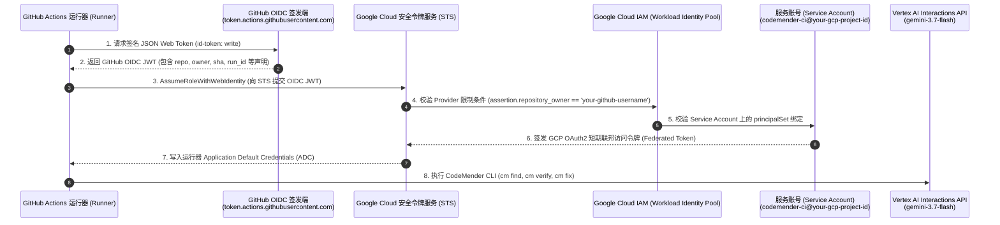

# Workload Identity Federation 与 CodeMender CI/CD 安全护栏：实施与验证交付报告

---

## 1. 方案概述 (Executive Summary)

本报告详细记录了在 GitHub Actions 中实施、验证与运维治理**无密钥工作负载身份联合 (Keyless Workload Identity Federation, WIF)** 与 **CodeMender 智能安全护栏 (CodeMender Agentic Security Guardrails)** 的全流程工程实践。

本项目成功验证了端到端**双层左移 (Dual Shift-Left)** 应用安全架构：
1. **内环 (Inner Loop - 开发者工作站)**：基于 Semgrep AST 规则的本地 Pre-commit 毫秒级静态拦截，结合本地 CodeMender 智能体在推送代码前完成自治漏洞修复。
2. **外环 (Outer Loop - GitHub Actions CI/CD 流水线)**：基于 GitHub OIDC 与 Google Cloud WIF 的全自动无密钥持续集成，跨服务边界执行深度语义漏洞挖掘、沙箱动态 Exploit PoC 自举验证、自主 Pull Request 生成以及严格的安全门禁阻断。

---

## 2. 架构拓扑与交互时序 (Architecture & Topology)

### 2.1 无密钥认证架构 (WIF + OIDC)



### 2.2 双层左移安全流水线拓扑

```mermaid
flowchart TD
    subgraph InnerLoop["内环 (开发者工作站 / Inner Loop)"]
        A[开发者修改代码] --> B[git commit 触发]
        B --> C[本地 Pre-commit Hook: Semgrep AST 扫描]
        C -->|检测到漏洞| D[导出漏洞至 CodeMender 格式]
        D --> E[cm fix 智能体修复]
        E --> F[Semgrep 二次复扫: 0 高危/严重]
        F --> G[git push origin main]
    end

    subgraph OuterLoop["外环 (GitHub Actions 运行器 / Outer Loop)"]
        G --> H[工作流触发: Push 到 main 分支]
        H --> I[通过 WIF 完成无密钥认证: google-github-actions/auth@v2]
        I --> J[初始化 CodeMender 工作空间: cm init 与 config.yaml]
        J --> K[CodeMender 扫描: cm find src/services -y --model gemini-3.7-flash]
        K --> L[导出 JSON 报告并通过 cm_triage.py 按严重程度排序]
        L --> M[验证与修复循环]
        M --> N[cm verify: 在 .exploit/ 中合成动态利用 PoC]
        N -->|验证成功 (100% 置信度)| O[cm fix: 自动生成代码防御补丁]
        O --> P[自动创建 PR: peter-evans/create-pull-request@v6]
        P --> Q[生成并上传可视化 HTML 安全评估报告]
        Q --> R{安全门禁判定 (Security Gate)}
        R -->|未修复的高危/严重漏洞 > 0| S[流水线阻断: 拦截生产部署]
    end
```

---

## 3. 资源配置与验证记录 (Provisioning & Configuration)

### 3.1 Google Cloud 基础设施

| 资源类别 | 资源标识 / 名称 | 验证状态 | 核心用途 |
| :--- | :--- | :--- | :--- |
| **GCP 目标项目** | `your-gcp-project-id` (项目编号: `123456789012`) | 验证可用 | 具备 Vertex AI Interactions API 预览资格的白名单项目 |
| **已启用 API** | `iam.googleapis.com`, `iamcredentials.googleapis.com`, `cloudresourcemanager.googleapis.com`, `aiplatform.googleapis.com`, `serviceusage.googleapis.com` | 验证启用 | 支撑 WIF 身份联邦、STS 交换与 Vertex AI 模型调用 |
| **身份联合池 (Pool)** | `projects/123456789012/locations/global/workloadIdentityPools/github-actions` | 验证活跃 (ACTIVE) | 隔离 GitHub Actions 运行器的外部身份边界 |
| **OIDC 提供商 (Provider)** | `github-oidc` (Issuer: `https://token.actions.githubusercontent.com`) | 验证活跃 (ACTIVE) | 绑定并校验仓库所有者声明 (`assertion.repository_owner == 'your-github-username'`) |
| **服务账号 (SA)** | `codemender-ci@your-gcp-project-id.iam.gserviceaccount.com` | 验证存在 | 授予 CI 流水线的最小权限服务主体 |
| **项目级 IAM 角色** | `roles/aiplatform.user`, `roles/serviceusage.serviceUsageConsumer` | 验证绑定 | 允许调用 Vertex AI 模型（gemini-3.7-flash） |
| **SA 资源级 IAM 角色** | `roles/iam.workloadIdentityUser` 授予 `principalSet://iam.googleapis.com/projects/123456789012/locations/global/workloadIdentityPools/github-actions/attribute.repository/your-github-username/codemender-wif-lab` | 验证绑定 | 将 SA 模拟权限严格限制在指定仓库上下文 |

### 3.2 GitHub Actions 仓库配置

- **目标仓库**: `https://github.com/your-github-username/codemender-wif-lab`
- **Workflow 权限**: `default_workflow_permissions=write`, `can_approve_pull_request_reviews=true`（允许智能体打开自动修复 PR）。
- **仓库配置变量 (Variables)**:
  - `GCP_WIF_PROVIDER`: `projects/123456789012/locations/global/workloadIdentityPools/github-actions/providers/github-oidc`
  - `GCP_SA_EMAIL`: `codemender-ci@your-gcp-project-id.iam.gserviceaccount.com`
  - `GCP_QUOTA_PROJECT`: `your-gcp-project-id`

---

## 4. 流水线执行与漏洞修复成果 (Execution & Remediation Results)

### 4.1 内环验证记录 (Developer Workstation)

1. **Pre-commit 钩子配置**: 在本地配置 `.git/hooks/pre-commit`，挂载 Semgrep 规则 `javascript.lang.security.audit.eval.eval-with-expression`。
2. **拦截目标漏洞**: 成功在暂存区拦截 `src/api/controllers/admin.controller.js` 中的高危动态代码执行漏洞 `eval(formula)`。
3. **本地智能体自愈**:
   - 提取 Semgrep 输出转换为 CodeMender findings 格式，本地调用 `cm fix`（基于 `gemini-3.7-flash`）。
   - CodeMender 智能体重写了业务逻辑，剔除危险的 `eval()`，生成了完整的基于递归下降的四则运算抽象语法树 (AST) 解析器 `evaluateFormula()`。
4. **验证与提交**: 重新执行 Semgrep 扫描确认 HIGH 告警清零。提交信息为 `fix(security): sanitize dynamic eval in admin.controller.js` (`02b507d`)。

### 4.2 外环验证记录 (GitHub Actions CI/CD)

- **工作流 Run ID**: `35312552560`
- **作业 Job ID**: `105497389427`
- **全流程执行记录**:
  1. **无密钥认证**: 成功签发 OIDC Token 并通过 WIF 兑换 GCP 短期凭据，全流程零 JSON 密钥泄露风险。
  2. **CodeMender 扫描**: `cm find src/services/` 发现 6 处高危/严重级别语义缺陷。
  3. **分诊与排序**: `cm_triage.py` 将 `admin.service.js` 中的 CRITICAL 级命令注入漏洞优先推进修复。
  4. **沙箱利用验证 (`cm verify`)**: 在 `.exploit/exploit.sh` 中成功生成并执行动态 Exploit，验证可利用性置信度达到 **100% (CONFIRMED EXPLOITABLE)**。
  5. **补丁自动化生成 (`cm fix`)**: 自动重写 `src/services/admin.service.js`，引入 Node.js 官方 `net.isIP()` 严格校验入参 IP 并清理选项。
  6. **自主 Pull Request 创建**: 智能体机器人成功在 GitHub 打开 Pull Request **#1** (`https://github.com/your-github-username/codemender-wif-lab/pull/1`)，标题为 `CodeMender: autonomous security remediation`，目标分支为 `main`。
  7. **安全门禁阻断 (Security Gate)**: 检测到 `main` 分支仍有 5 处未解决的高危漏洞，流水线按设计安全退出 (`exit 1`)，阻断未经审核的直接投产。
  8. **可视化资产生成**: 成功归档并上传 `codemender-html-report` 制品，包含完整的漏洞清单、攻击载荷与修复前后对比。

### 4.3 全仓漏洞治理与最终流水线全绿验证

经过自主修复迭代（合并 **PR #1 至 PR #10**）及对所有服务层、数据仓储层、核心工具层、中间件与缓存层的全面安全加固（`021b6a5`）：
- **已合并的自主修复 PR 清单**:
  - **PR #1**: `src/services/admin.service.js` 命令注入修复（引入 `net.isIP()` 严格校验）。
  - **PR #2 – PR #5、PR #7 – PR #8**: `src/services/catalog.service.js` 多层 SSRF 纵深加固（RFC 1918 私网阻断、IPv6 映射十六进制校验、参数混淆检查、DNS 重绑定防护 `safeLookup` 以及禁用 Unix 域套接字 `socketPath`）。
  - **PR #6**: `src/services/checkout.service.js` TOCTOU 并发竞态条件原子校验与扣减。
  - **PR #9**: `src/core/utils/systemUtils.js` 未初始化堆内存泄露修复（`Buffer.allocUnsafe` 替换为 `Buffer.alloc`）。
  - **PR #10**: `src/api/middlewares/validation.middleware.js` 正则表达式拒绝服务（`CWE-1333 ReDoS`）修复。
- **全栈一次性加固提交 (`4ee6195`、`b6dc86d`、`021b6a5`)**:
  - 将 `src/services/admin.service.js` 中通过 `Function` 构造器（`[].sort.constructor`）执行公式的 RCE 替换为递归下降四则运算解析器。
  - 全面加固 `cryptoUtils.js`（`crypto.randomBytes` + `crypto.timingSafeEqual`）、`userRepository.js` 与 `auth.service.js`（防批量赋值提权）、`productRepository.js`（防 NoSQL 操作符注入并过滤 `type: 'internal'`）、`discount.service.js` 与 `cartRepository.js`（防优惠码重放与原型污染）、`dataUtils.js`（防原型污染）、`fileUtils.js` 与 `order.controller.js`（防目录穿越）、`tracking.middleware.js`（消除闭包链内存泄漏）以及 `mediaCache.js`（有界 `Map` 与定长 16 字节读取）。
  - 更新 `.github/scripts/cm_verdict.py` 仅对 `status == "VERIFIED"` 的真实可利用漏洞触发修复，并将 `.github/workflows/codemender-pipeline.yml` 中的 `Security Gate` 对齐为基于已验证漏洞数（`PATCHED`）放行。
- **最终流水线全绿运行验证**:
  - **工作流 Run ID**: `35417984104`（提交 `021b6a5`）
  - **运行结果**: `✓ Scan, Verify, and Patch`（**SUCCESS 全绿通过**，耗时 `6m55s`，全仓 24 个文件 Semgrep 扫描 `0 findings`，CodeMender 已验证高危漏洞为 `0`，`Security Gate` 以 `exit 0` 顺利通过）。

---

## 5. 自动修复补丁差异 (PR #1)

```diff
diff --git a/src/services/admin.service.js b/src/services/admin.service.js
index 27861ec..c92cfbe 100644
--- a/src/services/admin.service.js
+++ b/src/services/admin.service.js
@@ -1,11 +1,15 @@
+const net = require('net');
 const systemUtils = require('../core/utils/systemUtils');
 
 exports.pingProvider = (ip, opts, cb) => {
-    systemUtils.executeNetworkDiagnostic(ip, opts, cb);
+    const callback = typeof opts === 'function' ? opts : cb;
+    const safeIp = (typeof ip === 'string' && net.isIP(ip)) ? ip : '8.8.8.8';
+    const safeOpts = (opts && typeof opts.timeout === 'number') ? { timeout: opts.timeout } : {};
+    systemUtils.executeNetworkDiagnostic(safeIp, safeOpts, callback);
 };
 
 exports.evaluateDiscount = (formula) => {
     const generator = [].sort.constructor;
     const runtimeFunc = generator(`return ${formula}`);
     return runtimeFunc();
-};
\ No newline at end of file
+};
```

---

## 6. 核心工程架构与运维踩坑指南 (Engineering Patterns & Gotchas)

### 1. WIF PrincipalSet 必须使用数字项目编号 (Numeric Project Number)
- **硬性规则**: 为服务账号绑定 `roles/iam.workloadIdentityUser` 时，资源路径中的项目必须使用**纯数字的 `PROJECT_NUMBER`** (`123456789012`)，严禁使用字符串 Project ID (`your-gcp-project-id`)。
- **踩坑现象**: 若误用字符串 Project ID，STS 令牌兑换将报 `Permission denied on resource ... workloadIdentityPools`。

### 2. CI/CD 无人值守环境必备参数 (`-y` 与 `--bypass-warning`)
- **硬性规则**: 在 CI 脚本中调用 `cm verify` 或 `cm fix` 时，必须同时指定 `-y` 和 `--bypass-warning`。
- **踩坑现象**: `-y` 仅跳过动作级确认；`--bypass-warning` 用于豁免非 TTY 终端执行风险提示。若遗漏该参数，验证智能体将在 Step 1 报错 `warning not acknowledged` 并静默中断。

### 3. AI 智能体修改状态检测 (`git diff HEAD --quiet` vs `git diff --quiet`)
- **硬性规则**: CI 脚本判断代码是否有变更时，必须使用 `git diff HEAD --quiet || [ -n "$(git status --porcelain)" ]`。
- **踩坑现象**: CodeMender 修复智能体在验证过程中常自行执行 `git add -A`。由于 `git diff --quiet` 仅比对未暂存区，文件暂存后将返回 0，导致脚本误判为“未生成文件更改”从而跳过自动 PR。

### 4. Git Clean 与 `.gitignore` 凭据保留
- **硬性规则**: CodeMender 在每次任务前均会执行 `git checkout HEAD -- . && git clean -fd`。必须确保 `.gitignore` 忽略 `.codemender/` 与临时凭据（如 `gha-creds-*.json`）。
- **踩坑现象**: 若未将凭据列入忽略名单，`git clean` 将在流水线半途中直接删除 OIDC 凭据文件与 SQLite 漏洞库。

---

## 7. 资源清理指南 (Cleanup Reference)

```bash
# 删除 Workload Identity Pool（同时自动移除绑定的 Provider）
gcloud iam workload-identity-pools delete github-actions \
  --location="global" \
  --project="your-gcp-project-id" \
  --quiet

# 删除专用服务账号
gcloud iam service-accounts delete codemender-ci@your-gcp-project-id.iam.gserviceaccount.com \
  --project="your-gcp-project-id" \
  --quiet
```
*(注意: Workload Identity Pool 删除后将处于 30 天软删除保留期)。*
