# CodeMender & WIF Security Lab: Comprehensive Vulnerability Remediation Report

---

## 1. Executive Overview

Across the **Inner Loop (Local Pre-Commit + Semgrep + CodeMender CLI)**, **Outer Loop (10 Autonomous GitHub Actions PRs: PR #1 – PR #10)**, and **Full-Stack Batch Hardening (`4ee6195`, `b6dc86d`, `021b6a5`)**, a total of **16 distinct security vulnerabilities and reliability flaws** across **19 files** were identified, verified, and remediated.

The final GitHub Actions workflow run (**[Run #35417984104](https://github.com/your-github-username/codemender-wif-lab/actions/runs/35417984104)**) completed in **6m 55s** with **0 Semgrep findings**, **0 verified CodeMender vulnerabilities**, and a passing **Security Gate (`exit 0`)**.

---

## 2. Architecture of Remediated Layers

```mermaid
flowchart TB
    subgraph CICD["1. CI/CD & WIF Governance Layer"]
        WIF["Keyless WIF + OIDC Auth"]
        PIPE["codemender-pipeline.yml<br/>(--bypass-warning, git diff HEAD, Security Gate)"]
        VERDICT["cm_verdict.py<br/>(Strict status == VERIFIED gating)"]
    end

    subgraph API["2. API Controllers & Middlewares"]
        ADMIN_CTRL["admin.controller.js<br/>(Removed eval() RCE -> AST Parser)"]
        VAL_MW["validation.middleware.js<br/>(PR #10: Fixed CWE-1333 ReDoS)"]
        TRACK_MW["tracking.middleware.js<br/>(Fixed 1MB/req Closure Memory Leak)"]
        AUTH_MW["auth.middleware.js<br/>(Timing-Safe Admin Token Check)"]
        ORDER_CTRL["order.controller.js<br/>(Bounded Invoice Size & Safe File Read)"]
        PROD_CTRL["product.controller.js<br/>(Sanitized fileId & Temp File Cleanup)"]
    end

    subgraph SVC["3. Business Services Layer"]
        ADMIN_SVC["admin.service.js<br/>(PR #1: IP Validation; Removed Function() RCE)"]
        CAT_SVC["catalog.service.js<br/>(PR #2-#5,#7-#8: SSRF, DNS Rebinding, Socket Bypass)"]
        CHK_SVC["checkout.service.js<br/>(PR #6: Atomic TOCTOU Inventory Check)"]
        AUTH_SVC["auth.service.js<br/>(Blocked Mass Assignment Privilege Escalation)"]
        DISC_SVC["discount.service.js<br/>(Single-Use Promo Replay Prevention)"]
    end

    subgraph DATA["4. Data Repositories & Core Utilities"]
        USER_REPO["userRepository.js<br/>(Allowlisted Profile Fields: name, email)"]
        PROD_REPO["productRepository.js<br/>(NoSQL Injection Defense & Internal Item Filter)"]
        CART_REPO["cartRepository.js<br/>(Null-Prototype Store & Applied Promo Tracking)"]
        SYS_UTIL["systemUtils.js<br/>(PR #9: Buffer.alloc & Removed child_process)"]
        CRYP_UTIL["cryptoUtils.js<br/>(crypto.randomBytes & timingSafeEqual)"]
        DATA_UTIL["dataUtils.js<br/>(Blocked __proto__ / constructor Pollution)"]
        FILE_UTIL["fileUtils.js<br/>(Path Traversal Containment)"]
        MEDIA_CACHE["mediaCache.js<br/>(16B Slice Read & Bounded Map Cache)"]
    end

    CICD --> API --> SVC --> DATA
```

---

## 3. Detailed Breakdown of All 16 Remediated Vulnerabilities

### 3.1 API Controllers & Middlewares (`src/api/`)

| # | File | Vulnerability Type (CWE) | Root Cause (Before) | Remediation Applied (After) | Fix Source |
| :--- | :--- | :--- | :--- | :--- | :--- |
| **1** | `src/api/controllers/admin.controller.js` | **Code Injection / `eval()` RCE** (`CWE-95`) | `previewDynamicPricing` passed user-supplied `req.body.formula` directly into `eval(formula)`. | Replaced `eval()` with a custom recursive-descent arithmetic AST parser (`evaluateFormula`) supporting only numeric literals and `+ - * / % ( )`. | Inner Loop (`cm fix`, `02b507d`) |
| **2** | `src/api/middlewares/validation.middleware.js` | **Regular Expression DoS (ReDoS)** (`CWE-1333`) | `validateCorporateEmail` built nested quantifiers `^([a-zA-Z0-9_]+\s?-?)+` concatenated with unescaped `corporateDomain`. | Added `escapeRegex()`, enforced 254-char RFC email length cap, and replaced nested group quantifiers with linear `^[a-zA-Z0-9._%+-]+@${escapedDomain}$`. | **PR #10** (`cb62dcd`) |
| **3** | `src/api/middlewares/tracking.middleware.js` | **Closure Chain Memory Leak / DoS** (`CWE-400`) | Retained `const prev = activeSessions` inside closure on every request while allocating a 1MB string (`new Array(1000000).join('*')`), causing linear heap exhaustion. | Removed closure retention chain and 1MB buffer; bounded `activeSessions` ring buffer to `MAX_TRACKED_SESSIONS = 100`. | Batch Hardening (`021b6a5`) |
| **4** | `src/api/middlewares/auth.middleware.js` | **Timing Side-Channel & Hardcoded Secret** (`CWE-208`) | Compared `authorization` header using standard `===` against a static string. | Implemented constant-time comparison via `crypto.timingSafeEqual` and environment variable support (`process.env.ADMIN_TOKEN`). | Batch Hardening (`021b6a5`) |
| **5** | `src/api/controllers/order.controller.js` | **Unbounded Memory Allocation & Express `sendFile` Sink** (`CWE-770`, `CWE-22`) | `exportInvoice` accepted arbitrarily large `layoutSize`; `downloadDigitalItem` passed path directly to `res.sendFile(p)`. | Capped `layoutSize <= 4096`, enforced `fileUtils.getSafeDownloadPath()`, verified `fs.statSync(p).isFile()`, and sent validated buffer with `application/octet-stream`. | Batch Hardening (`021b6a5`) |

---

### 3.2 Business Services (`src/services/`)

| # | File | Vulnerability Type (CWE) | Root Cause (Before) | Remediation Applied (After) | Fix Source |
| :--- | :--- | :--- | :--- | :--- | :--- |
| **6** | `src/services/admin.service.js` | **OS Command Injection** (`CWE-78`) | `pingProvider` forwarded unvalidated `ip` and `opts` to `executeNetworkDiagnostic`, which interpolated `-W ${opts.timeout} ${ip}` into `child_process.exec('ping ...')`. | Validated `ip` via `net.isIP()`, constrained `timeout` to integer bounds (`1..30`), and replaced shell execution with deterministic simulated latency statistics. | **PR #1** (`fc22bc7`) & Commit `b6dc86d` |
| **7** | `src/services/admin.service.js` | **Constructor RCE Bypass (`Function`)** (`CWE-94`) | `evaluateDiscount` accessed the `Function` constructor via `[].sort.constructor` (`generator(\`return ${formula}\`)()`), allowing full Node.js RCE. | Removed `[].sort.constructor` completely and replaced with a strict character whitelist (`^[0-9+\-*/().%\s]+$`) and recursive-descent arithmetic parser. | Batch Hardening (`4ee6195`) |
| **8** | `src/services/catalog.service.js` | **Multi-Vector SSRF, DNS Rebinding & Unix Socket Bypass** (`CWE-918`) | `fetchRemoteAsset` accepted raw URLs/options, allowing access to `169.254.169.254` metadata, RFC 1918 private IPs, IPv6-mapped hex (`::ffff:7f00:1`), DNS rebinding, and `socketPath` local Unix sockets. | Validated URL protocol (`http:`/`https:`), blocked all private/loopback/link-local IPv4 & IPv6 ranges (including hex/dotted IPv4-mapped IPv6), blocked `socketPath`, and eliminated arbitrary outbound socket connections. | **PR #2 – #5, PR #7 – #8** & Commit `b6dc86d` |
| **9** | `src/services/checkout.service.js` | **TOCTOU Race Condition (Double-Spending Inventory)** (`CWE-362`) | `processOrder` checked `inventory[item] < qty`, yielded the event loop via `await setTimeout(50)`, and only decremented `inventory[item] -= qty` afterward. | Performed atomic check-and-decrement (`inventory[item] -= qty`) **before** the async payment `await`, rolling back (`inventory[item] += qty`) on failure. | **PR #6** (`d5072b4`) |
| **10** | `src/services/discount.service.js` & `src/data/repositories/cartRepository.js` | **Business Logic Bypass (Infinite Promo Replay)** (`CWE-840`) | `applyPromoToCart` multiplied `cart.total * 0.8` without tracking whether `SAVE20` had already been applied to the cart, enabling near-zero total via repeated calls. | Added `appliedPromos` array tracking per cart, rejected duplicate promo application (`Promo already applied`), rounded currency to cents, and stored carts in `Object.create(null)`. | Batch Hardening (`4ee6195`) |

---

### 3.3 Data Repositories (`src/data/repositories/`)

| # | File | Vulnerability Type (CWE) | Root Cause (Before) | Remediation Applied (After) | Fix Source |
| :--- | :--- | :--- | :--- | :--- | :--- |
| **11** | `src/data/repositories/userRepository.js` & `src/services/auth.service.js` | **Mass Assignment Privilege Escalation** (`CWE-915`) | `Object.assign(users[id], payload)` allowed any user calling `PUT /api/v1/user/profile/:id` with `{"role": "admin"}` to escalate privileges. | Restricted updatable fields strictly to `['name', 'email']` via explicit property checks and returned shallow clones to prevent internal state mutation. | Batch Hardening (`4ee6195`) |
| **12** | `src/data/repositories/productRepository.js` | **NoSQL Operator Injection & Sensitive Data Exposure** (`CWE-943`, `CWE-200`) | `findByFilter` interpreted `$ne` and `$in` operators from user JSON input and searched across `type: 'internal'` records (leaking `Admin Master Key`). | Restricted searchable items strictly to `p.type === 'public'` and required primitive string/number equality on an explicit field allowlist (`id`, `name`, `price`). | Batch Hardening (`4ee6195`) |

---

### 3.4 Core Utilities & Cache (`src/core/`)

| # | File | Vulnerability Type (CWE) | Root Cause (Before) | Remediation Applied (After) | Fix Source |
| :--- | :--- | :--- | :--- | :--- | :--- |
| **13** | `src/core/utils/systemUtils.js` | **Uninitialized Heap Memory Disclosure** (`CWE-908`) | `allocateBuffer(size)` used obfuscated `Buffer.allocUnsafe(size)` (`Buffer['\x61\x6c\x6c\x6f\x63\x55\x6e\x73\x61\x66\x65']`), leaking in-memory secrets/tokens via `/api/v1/order/invoice`. | Replaced `Buffer.allocUnsafe` with zero-filled `Buffer.alloc(safeSize)` and capped allocation size at `4096` bytes. | **PR #9** (`84b06b1`) |
| **14** | `src/core/utils/cryptoUtils.js` | **Weak PRNG (`Math.random`) & Timing Attack** (`CWE-338`, `CWE-208`) | `generateToken()` used predictable `Math.random().toString(36)` for password reset tokens; `compareSignatures()` used a manual byte-by-byte loop vulnerable to timing attacks. | Replaced `Math.random()` with CSPRNG `crypto.randomBytes(32).toString('hex')` and replaced manual loop with `crypto.timingSafeEqual()`. | Batch Hardening (`4ee6195`) |
| **15** | `src/core/utils/dataUtils.js` | **Prototype Pollution** (`CWE-1321`) | `deepMerge(target, source)` recursively copied keys without filtering `__proto__`, `constructor`, or `prototype`. | Added `FORBIDDEN_KEYS = new Set(['__proto__', 'constructor', 'prototype'])` and strictly iterated using `Object.keys(source)`. | Batch Hardening (`4ee6195`) |
| **16** | `src/core/utils/fileUtils.js` & `src/core/cache/mediaCache.js` | **Path Traversal & Buffer Underlying Slab Retention** (`CWE-22`, `CWE-400`) | `resolveSafeLocalPath` stripped `../` only once (`replace(/\.\.\//g, '')`), easily bypassed via `....//`; `mediaCache.js` cached `fileBuffer.subarray(0, 16)`, pinning the entire 5MB `ArrayBuffer` in an unbounded global object. | Enforced `path.basename()` + `path.resolve()` prefix boundary verification inside `public/downloads`; replaced full-file `subarray` with a 16-byte `fs.readSync` copy in a bounded `Map` (`MAX_CACHE_ENTRIES = 100`). | Batch Hardening (`4ee6195`, `021b6a5`) |

---

## 4. CI/CD Pipeline & Governance Fixes

In addition to application code fixes, the following CI/CD pipeline mechanics were fixed to ensure reliable autonomous operation:
1. **Non-Interactive CodeMender Execution (`.github/workflows/codemender-pipeline.yml`)**: Added `--bypass-warning` alongside `-y` for `cm verify` and `cm fix` so headless GitHub Actions runners do not abort on TTY checks.
2. **Staged Modification Detection**: Updated the CI change detector from `git diff --quiet` to `git diff HEAD --quiet || [ -n "$(git status --porcelain)" ]` so files staged by CodeMender (`git add`) are properly committed and pushed to PR branches.
3. **Credential & SQLite State Preservation (`.gitignore`)**: Added `.codemender/` and `gha-creds-*.json` to `.gitignore` so CodeMender's internal `git clean -fd` does not wipe active WIF credentials or the findings database mid-run.
4. **Exploitability-Gated Verdict & Security Gate (`.github/scripts/cm_verdict.py`)**: Aligned `cm_verdict.py` to trigger patches only when `cm verify` proves exploitability (`status == "VERIFIED"`), and configured `Security Gate` to pass (`exit 0`) when `0` verified exploitable vulnerabilities remain.
