# CodeMender & WIF 安全实验：全栈漏洞治理与修复总结报告

---

## 1. 总体概览

在本次实验中，通过 **内环（本地 Pre-Commit + Semgrep + CodeMender CLI）**、**外环（GitHub Actions 自主生成的 10 个 Pull Request：PR #1 – PR #10）** 以及 **全栈一次性加固提交（`4ee6195`、`b6dc86d`、`021b6a5`）**，我们共在 **19 个核心文件**中识别、验证并彻底修复了 **16 类高危/严重安全漏洞与工程可靠性缺陷**。

最终 GitHub Actions 流水线（**[Run #35417984104](https://github.com/your-github-username/codemender-wif-lab/actions/runs/35417984104)**）在 **6 分 55 秒**内**全绿通过（`✓ Scan, Verify, and Patch`）**：全仓 24 个文件 Semgrep 扫描结果为 **`0 findings`**，CodeMender 验证可利用高危漏洞为 **`0`**，`Security Gate` 以 `exit 0` 顺利放行。

---

## 2. 分层安全治理架构全景

```mermaid
flowchart TB
    subgraph CICD["1. CI/CD 与 WIF 零信任治理层"]
        WIF["无密钥 WIF + OIDC 身份联邦认证"]
        PIPE["codemender-pipeline.yml<br/>(--bypass-warning, git diff HEAD, Security Gate)"]
        VERDICT["cm_verdict.py<br/>(严格校验 status == VERIFIED 裁决门禁)"]
    end

    subgraph API["2. API 控制器与中间件层"]
        ADMIN_CTRL["admin.controller.js<br/>(移除 eval() RCE -> 递归下降算术解析器)"]
        VAL_MW["validation.middleware.js<br/>(PR #10: 修复 CWE-1333 ReDoS 正则回溯)"]
        TRACK_MW["tracking.middleware.js<br/>(消除每次请求 1MB 闭包链内存泄漏)"]
        AUTH_MW["auth.middleware.js<br/>(恒定时间 Admin Token 比对)"]
        ORDER_CTRL["order.controller.js<br/>(限制发票内存块大小与安全文件读取)"]
        PROD_CTRL["product.controller.js<br/>(清洗 fileId 并通过 finally 清理临时文件)"]
    end

    subgraph SVC["3. 业务服务层"]
        ADMIN_SVC["admin.service.js<br/>(PR #1: IP 格式校验; 移除 Function() RCE)"]
        CAT_SVC["catalog.service.js<br/>(PR #2-#5,#7-#8: SSRF、DNS 重绑定、Unix 套接字防护)"]
        CHK_SVC["checkout.service.js<br/>(PR #6: 原子化 TOCTOU 库存校验与扣减)"]
        AUTH_SVC["auth.service.js<br/>(阻断批量赋值越权提权)"]
        DISC_SVC["discount.service.js<br/>(防优惠码无限重放攻击)"]
    end

    subgraph DATA["4. 数据仓储与底层工具层"]
        USER_REPO["userRepository.js<br/>(严格白名单字段更新: name, email)"]
        PROD_REPO["productRepository.js<br/>(防御 NoSQL 操作符注入并隔离内部商品)"]
        CART_REPO["cartRepository.js<br/>(无原型存储与已用优惠码记录)"]
        SYS_UTIL["systemUtils.js<br/>(PR #9: Buffer.alloc 零填充并移除 child_process)"]
        CRYP_UTIL["cryptoUtils.js<br/>(crypto.randomBytes 与 timingSafeEqual)"]
        DATA_UTIL["dataUtils.js<br/>(阻断 __proto__ / constructor 原型污染)"]
        FILE_UTIL["fileUtils.js<br/>(防多重目录穿越攻击)"]
        MEDIA_CACHE["mediaCache.js<br/>(定长 16 字节读取与有界 Map 缓存)"]
    end

    CICD --> API --> SVC --> DATA
```

---

## 3. 全部 16 项安全漏洞修复明细表

### 3.1 API 控制器与中间件层 (`src/api/`)

| # | 文件路径 | 漏洞类型 (CWE) | 修复前根因 (Before) | 修复后方案 (After) | 修复来源 |
| :--- | :--- | :--- | :--- | :--- | :--- |
| **1** | `src/api/controllers/admin.controller.js` | **代码注入 / `eval()` 远程代码执行** (`CWE-95`) | `previewDynamicPricing` 将用户输入的 `req.body.formula` 直接传入 `eval(formula)` 执行任意 JS 代码。 | 移除 `eval()`，实现纯四则运算递归下降 AST 解析器（`evaluateFormula`），仅支持数字与 `+ - * / % ( )`。 | 内环修复 (`cm fix`, `02b507d`) |
| **2** | `src/api/middlewares/validation.middleware.js` | **正则表达式拒绝服务 (ReDoS)** (`CWE-1333`) | `validateCorporateEmail` 使用嵌套量词 `^([a-zA-Z0-9_]+\s?-?)+` 并直接拼接未转义的 `corporateDomain`，恶意输入可挂起事件循环。 | 新增 `escapeRegex()` 转义域名，限制邮箱最大长度为 254 字符，并替换为线性正则 `^[a-zA-Z0-9._%+-]+@${escapedDomain}$`。 | **PR #10** (`cb62dcd`) |
| **3** | `src/api/middlewares/tracking.middleware.js` | **闭包引用链内存泄漏 / DoS** (`CWE-400`) | 每次请求在闭包中捕获 `const prev = activeSessions` 形成无限单向链表，并分配 1MB 字符串（`new Array(1000000).join('*')`），导致快速 OOM。 | 移除闭包引用链与 1MB 冗余分配，改为容量上限 `MAX_TRACKED_SESSIONS = 100` 的环形有界数组。 | 批量加固 (`021b6a5`) |
| **4** | `src/api/middlewares/auth.middleware.js` | **时序侧信道攻击与硬编码密钥** (`CWE-208`) | 使用普通 `===` 比对 `authorization` 请求头与静态硬编码密钥。 | 引入 `crypto.timingSafeEqual` 恒定时间比对，并支持从环境变量 `process.env.ADMIN_TOKEN` 读取密钥。 | 批量加固 (`021b6a5`) |
| **5** | `src/api/controllers/order.controller.js` | **无界内存分配与 `res.sendFile` 风险点** (`CWE-770`, `CWE-22`) | `exportInvoice` 未限制 `layoutSize` 上限；`downloadDigitalItem` 未捕获路径异常且直接调用 `res.sendFile(p)`。 | 限制 `layoutSize <= 4096`，在 `try/catch` 中调用 `getSafeDownloadPath()` 校验常规文件后通过 `application/octet-stream` 安全返回。 | 批量加固 (`021b6a5`) |

---

### 3.2 业务服务层 (`src/services/`)

| # | 文件路径 | 漏洞类型 (CWE) | 修复前根因 (Before) | 修复后方案 (After) | 修复来源 |
| :--- | :--- | :--- | :--- | :--- | :--- |
| **6** | `src/services/admin.service.js` | **OS 命令注入** (`CWE-78`) | `pingProvider` 将未校验的 `ip` 和 `opts` 传给 `executeNetworkDiagnostic`，后者通过字符串拼接执行 `child_process.exec('ping -c 1 -W ...')`。 | 使用 `net.isIP()` 严格校验 IPv4/IPv6 格式，限制 `timeout` 为 `1..30` 整数，并移除底层 Shell 子进程调用。 | **PR #1** (`fc22bc7`) & 提交 `b6dc86d` |
| **7** | `src/services/admin.service.js` | **原型链 `Function` 构造器 RCE** (`CWE-94`) | `evaluateDiscount` 通过 `[].sort.constructor` 获取 `Function` 构造器并执行 `return ${formula}`，可实现完整 RCE。 | 彻底移除 `[].sort.constructor`，替换为字符白名单（`^[0-9+\-*/().%\s]+$`）与递归下降数学表达式解析器。 | 批量加固 (`4ee6195`) |
| **8** | `src/services/catalog.service.js` | **多维 SSRF、DNS 重绑定与 Unix 域套接字绕过** (`CWE-918`) | `fetchRemoteAsset` 允许传入任意 URL 或请求配置对象，可访问云元数据 `169.254.169.254`、RFC 1918 内网、IPv6 十六进制映射地址（`::ffff:7f00:1`）、DNS 重绑定及本地 `socketPath`。 | 严格校验 `http:`/`https:` 协议，拦截全部私网/回环/链路本地 IPv4 与 IPv6 地址段（含十六进制 IPv4 映射），禁用 `socketPath` 并移除出站套接字风险点。 | **PR #2 – #5, PR #7 – #8** & 提交 `b6dc86d` |
| **9** | `src/services/checkout.service.js` | **TOCTOU 并发竞态条件（超卖漏洞）** (`CWE-362`) | `processOrder` 先检查 `inventory[item] < qty`，随后 `await setTimeout(50)` 挂起异步支付，恢复后才扣减库存，高并发下可超卖。 | 在异步 `await` **之前**同步完成库存校验与原子扣减（`inventory[item] -= qty`），若后续支付异常则回滚库存。 | **PR #6** (`d5072b4`) |
| **10** | `src/services/discount.service.js` & `src/data/repositories/cartRepository.js` | **业务逻辑绕过（优惠码无限重放）** (`CWE-840`) | `applyPromoToCart` 每次调用均直接执行 `cart.total * 0.8`，未记录优惠码使用状态，攻击者可重复调用将价格折算至接近 0。 | 在购物车对象中新增 `appliedPromos` 列表记录已使用的优惠码，拒绝重复应用同一优惠码，并采用 `Object.create(null)` 防原型污染。 | 批量加固 (`4ee6195`) |

---

### 3.3 数据仓储层 (`src/data/repositories/`)

| # | 文件路径 | 漏洞类型 (CWE) | 修复前根因 (Before) | 修复后方案 (After) | 修复来源 |
| :--- | :--- | :--- | :--- | :--- | :--- |
| **11** | `src/data/repositories/userRepository.js` & `src/services/auth.service.js` | **批量赋值越权提权 (Mass Assignment)** (`CWE-915`) | `Object.assign(users[id], payload)` 将请求体所有属性直接合并到用户对象，攻击者发送 `{"role": "admin"}` 即可提权为管理员。 | 严格限制允许更新的字段白名单为 `['name', 'email']`，忽略 `role`/`id` 等敏感字段，并返回浅拷贝对象防止外部篡改。 | 批量加固 (`4ee6195`) |
| **12** | `src/data/repositories/productRepository.js` | **NoSQL 操作符注入与敏感内部数据泄露** (`CWE-943`, `CWE-200`) | `findByFilter` 解析用户输入中的 `$ne` / `$in` 操作符，且未过滤 `type: 'internal'`，导致攻击者可导出 `Admin Master Key`。 | 强制限定仅检索 `p.type === 'public'` 的公开商品，禁用对象类型查询操作符（仅允许 `id`、`name`、`price` 基础类型精确匹配）。 | 批量加固 (`4ee6195`) |

---

### 3.4 核心工具与缓存层 (`src/core/`)

| # | 文件路径 | 漏洞类型 (CWE) | 修复前根因 (Before) | 修复后方案 (After) | 修复来源 |
| :--- | :--- | :--- | :--- | :--- | :--- |
| **13** | `src/core/utils/systemUtils.js` | **未初始化堆内存泄露 (Heartbleed 类漏洞)** (`CWE-908`) | `allocateBuffer(size)` 通过十六进制混淆调用 `Buffer.allocUnsafe(size)`，导致 `/api/v1/order/invoice` 接口直接回显进程堆内存中的敏感密钥与会话数据。 | 将 `Buffer.allocUnsafe` 替换为自动零填充的 `Buffer.alloc(safeSize)`，并限制单次分配上限为 `4096` 字节。 | **PR #9** (`84b06b1`) |
| **14** | `src/core/utils/cryptoUtils.js` | **弱伪随机数 (`Math.random`) 与时序攻击** (`CWE-338`, `CWE-208`) | `generateToken()` 使用可预测的 `Math.random().toString(36)` 生成密码重置令牌；`compareSignatures()` 使用逐字节循环比对签名。 | 使用密码学安全伪随机数生成器 `crypto.randomBytes(32).toString('hex')` 生成令牌，并使用 `crypto.timingSafeEqual()` 进行恒定时间签名验证。 | 批量加固 (`4ee6195`) |
| **15** | `src/core/utils/dataUtils.js` | **原型链污染 (Prototype Pollution)** (`CWE-1321`) | `deepMerge(target, source)` 递归合并属性时未过滤 `__proto__`、`constructor` 和 `prototype`。 | 定义 `FORBIDDEN_KEYS = new Set(['__proto__', 'constructor', 'prototype'])` 黑名单，并仅遍历 `Object.keys(source)` 自有属性。 | 批量加固 (`4ee6195`) |
| **16** | `src/core/utils/fileUtils.js` & `src/core/cache/mediaCache.js` | **目录穿越绕过与 Buffer 底层内存滞留** (`CWE-22`, `CWE-400`) | `resolveSafeLocalPath` 仅使用单次正则替换 `replace(/\.\.\//g, '')`（可被 `....//` 绕过）；`mediaCache.js` 对 5MB `fileBuffer` 调用 `subarray(0, 16)` 存入全局对象，导致整个 5MB `ArrayBuffer` 无法被 GC 回收。 | 使用 `path.basename()` 结合 `path.resolve()` 前缀边界校验确保路径严格位于 `public/downloads` 内；`mediaCache.js` 改为仅通过 `fs.readSync` 读取前 16 字节独立 Buffer 并存入容量上限为 100 的 `Map`。 | 批量加固 (`4ee6195`, `021b6a5`) |

---

## 4. CI/CD 流水线与工程治理修复

除业务代码漏洞外，我们还修复了 CI/CD 自动化流水线中的 4 项关键工程问题，确保流水线长期稳定运行：
1. **非交互式 TTY 安全门禁确认 (`.github/workflows/codemender-pipeline.yml`)**：为 `cm verify` 和 `cm fix` 补充 `--bypass-warning` 参数，解决 GitHub Actions 无头 Runner 因缺少交互式终端导致的步骤中断。
2. **已暂存文件变更检测 (`git diff HEAD`)**：将补丁检测逻辑从 `git diff --quiet` 升级为 `git diff HEAD --quiet || [ -n "$(git status --porcelain)" ]`，确保 CodeMender 自动 `git add` 暂存的修复文件能被正确提交并创建 PR。
3. **WIF 凭据与 SQLite 状态防清理保护 (`.gitignore`)**：在 `.gitignore` 中加入 `.codemender/` 与 `gha-creds-*.json`，防止 CodeMender 内部执行 `git clean -fd` 时误删正在使用的 WIF 临时令牌或漏洞数据库。
4. **基于动态可利用性的精准门禁裁决 (`.github/scripts/cm_verdict.py`)**：将 `cm_verdict.py` 校准为仅当 `cm verify` 沙箱验证状态为 `VERIFIED`（确认可利用）时才触发补丁生成，并将 `Security Gate` 对齐为当可利用高危漏洞数为 `0` 时顺利通过（`exit 0`）。
